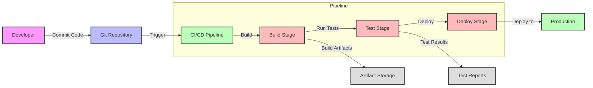

```mermaid
graph LR
    A[Developer] -->|Commit Code| B[Git Repository]
    B -->|Trigger| C[CI/CD Pipeline]
    
    subgraph Pipeline
        C -->|Build| D[Build Stage]
        D -->|Run Tests| E[Test Stage]
        E -->|Deploy| F[Deploy Stage]
    end
    
    D -->|Build Artifacts| G[Artifact Storage]
    E -->|Test Results| H[Test Reports]
    F -->|Deploy to| I[Production]
    
    style A fill:#f9f,stroke:#333,stroke-width:2px
    style B fill:#bbf,stroke:#333,stroke-width:2px
    style C fill:#bfb,stroke:#333,stroke-width:2px
    style D fill:#fbb,stroke:#333,stroke-width:2px
    style E fill:#fbb,stroke:#333,stroke-width:2px
    style F fill:#fbb,stroke:#333,stroke-width:2px
    style G fill:#ddd,stroke:#333,stroke-width:2px
    style H fill:#ddd,stroke:#333,stroke-width:2px
    style I fill:#bfb,stroke:#333,stroke-width:2px
``` 