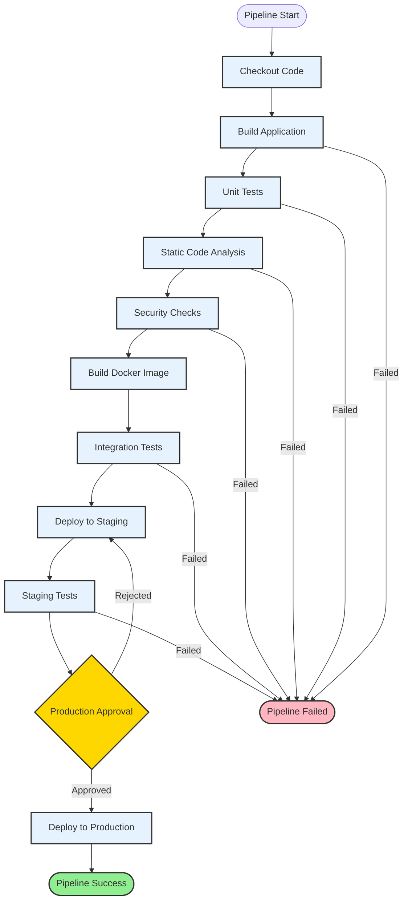

```mermaid
graph TD
    Start([Pipeline Start]) --> Checkout[Checkout Code]
    Checkout --> Build[Build Application]
    Build --> Test[Unit Tests]
    Test --> StaticAnalysis[Static Code Analysis]
    StaticAnalysis --> SecurityChecks[Security Checks]
    SecurityChecks --> DockerBuild[Build Docker Image]
    DockerBuild --> IntegrationTests[Integration Tests]
    
    %% Staging Deployment
    IntegrationTests --> StagingDeploy[Deploy to Staging]
    StagingDeploy --> StagingTests[Staging Tests]
    
    %% Production Deployment with Approval
    StagingTests --> Approval{Production Approval}
    Approval -->|Approved| ProdDeploy[Deploy to Production]
    Approval -->|Rejected| StagingDeploy
    
    %% Success/Failure Paths
    ProdDeploy --> Success([Pipeline Success])
    StagingTests -->|Failed| Failure([Pipeline Failed])
    IntegrationTests -->|Failed| Failure
    SecurityChecks -->|Failed| Failure
    StaticAnalysis -->|Failed| Failure
    Test -->|Failed| Failure
    Build -->|Failed| Failure
    
    %% Styling
    classDef success fill:#90EE90,stroke:#333,stroke-width:2px
    classDef failure fill:#FFB6C1,stroke:#333,stroke-width:2px
    classDef process fill:#E6F3FF,stroke:#333,stroke-width:2px
    classDef decision fill:#FFD700,stroke:#333,stroke-width:2px
    
    class Success success
    class Failure failure
    class Checkout,Build,Test,StaticAnalysis,SecurityChecks,DockerBuild,IntegrationTests,StagingDeploy,StagingTests,ProdDeploy process
    class Approval decision
``` 